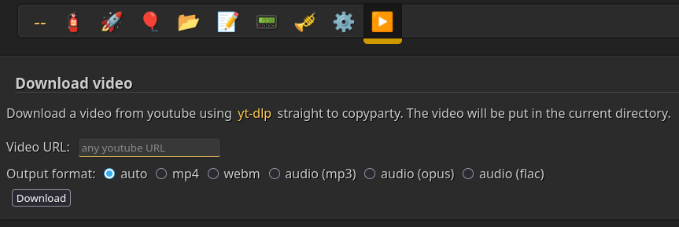

# Copyparty yt-dlp plugin



Download any youtube video directly to copyparty, using just event hooks and a JavaScript file.

## Installation

1. Download `ytdlp_hook.py` and `ytdlp.js`.
2. Add this to your config:
```
[global]
	xm: I,<path to ytdlp_hook.py>
	js-browser: <path to ytdlp.js>

For example:

[global]
	xm: I,/home/user/ytdlp_hook.py
	js-browser: /home/user/ytdlp.js
```
> [!NOTE]
> You can also use command-line arguments (`--xm=I,ytdlp_hook.py --js-browser=ytdlp.js`) of course.
3. Download [yt-dlp](https://github.com/yt-dlp/yt-dlp/releases/latest) and put the file next to the `ytdlp_hook.py` script (or install it system-wide).
4. Now restart copyparty and open up the ▶️-icon in the menu bar, enter a video URL, select your quality, and click Download.

> [!NOTE]
> If you can't convert videos, then it's possible that yt-dlp can't be found. In that case, try to put it in `/usr/bin/` or in another directory that is in the `PATH`.

## Requirements & FFmpeg

For `yt-dlp` to successfully extract audio (mp3/flac) or merge high-quality videos into `.mp4`, it requires **FFmpeg** to be accessible.

- **Standard Installation:** You can install both `yt-dlp` and `ffmpeg` using your system's package manager. The script will automatically use the system-wide commands.
- **Portable Installation:** You can download the `yt-dlp` and `ffmpeg` (or `ffmpeg.exe`) standalone binaries and place them directly in the same directory as the `ytdlp_hook.py` script. The script will prioritize these local files automatically.

> [!WARNING] 
> **Note for Docker users:** The internal FFmpeg bundled inside the copyparty Alpine Docker image is heavily stripped (`--disable-muxers`) and will crash when trying to merge MP4s or extract audio. Using `apk add ffmpeg` will fail to override it. You MUST download a full static `ffmpeg` binary and place it directly next to `ytdlp_hook.py`.

## Features

- *seamless* integration into the browser UI
- video quality selector (4k, 2k, 1080p, 720p, 480p)
- transcoding into mp4, webm, mp3, opus, and flac
- only users with the `w` permission can upload videos into a volume

## TODOs

- progress bar of some kind
- auto-download and auto-update for yt-dlp
- there isn't a whole lot more possible with just hooks alone ¯\\\_(ツ)\_/¯